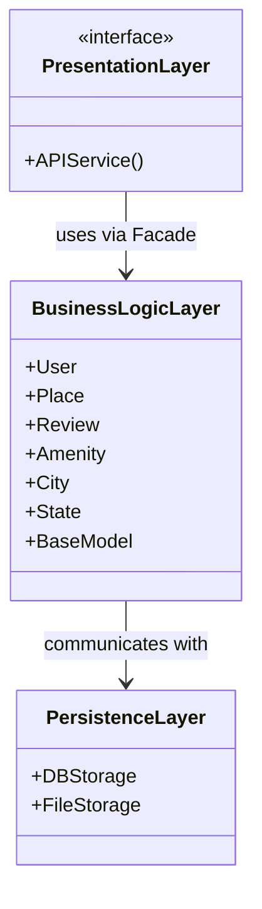
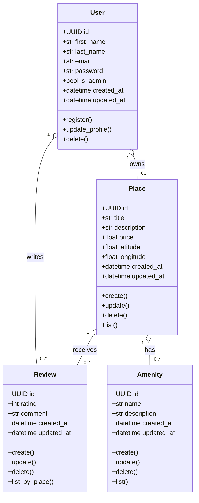

## Part 1 of the project HOLBERTONSCHOOL - HBNB

# 🏠 AirBnB Clone - Architecture Overview

This project is a simplified clone of the AirBnB platform, demonstrating a structured and layered architecture using object-oriented design principles and storage abstraction.

## 🔧 Technologies Used

- Language: **C** / **Python**
- Storage: **JSON File** or **MySQL Database**
- Architecture: **3-Layered Architecture**
- Version Control: **Git**

---

## 📐 System Architecture

The system is organized into **three main layers**:

1. **Presentation Layer**
2. **Business Logic Layer**
3. **Persistence Layer**

### 🧠 High-Level Architecture Diagram

---

## 🏗️ Business Logic Layer - Class Diagram

---

## 📒 Entity Descriptions

- **User**: Represents a user of the platform. Can be a regular user or an administrator. Users can register, update their profile, and be deleted. Each user can own multiple places and write multiple reviews.
- **Place**: Represents a property listed by a user. Contains details such as title, description, price, and location. Each place is owned by a user, can have multiple amenities, and can receive multiple reviews.
- **Review**: Represents a review left by a user for a place. Contains a rating and a comment. Each review is associated with one user and one place.
- **Amenity**: Represents an amenity that can be associated with places (e.g., Wi-Fi, Pool). Each amenity can be linked to multiple places.

### Relationships

- **User–Place**: A user can own multiple places.
- **Place–Review**: A place can have multiple reviews.
- **User–Review**: A user can write multiple reviews.
- **Place–Amenity**: A place can have multiple amenities.

---